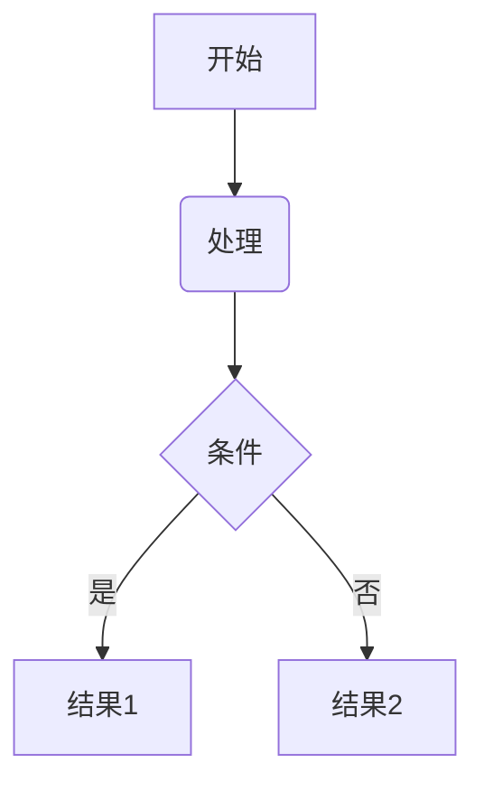
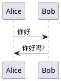

# VSCode Markdown Diagram Extension

[](https://marketplace.visualstudio.com/items?itemName=skyer.vscode-markdown-diagram)
[](./LICENSE.md)

[中文](./README.zh.md)

A VSCode extension for rendering diagrams (flowcharts, sequence diagrams, class diagrams, UML, etc.) in Markdown preview.

## Features

- Supports multiple diagram syntaxes: Mermaid/PlantUML/DOT/ditaa
- Diagram rendering powered by [markdown-it-diagram](https://ryanuo.cc/zh/posts/md-it-diagarm)
- Lightweight and high-performance Markdown preview enhancement
- Rich control features:
  - Zoom, pan, rough rendering
  - Copy source code
- Interactive operations:
  - Shift + mouse wheel to zoom
  - Hold left mouse button to drag
  - Integrated modal preview mode
- Configurable options:
  - Set maximum diagram height (default: 600px)
  - Different Mermaid themes for VSCode dark/light modes

## Usage

1. Write diagrams using Mermaid or PlantUML syntax in Markdown files
2. Open Markdown preview to view rendered diagrams

Example:
````markdown
## Mermaid



## PlantUML


````

Preview:


## Contributing

Issues and PRs are welcome. Please ensure:
1. Code follows ESLint rules
2. Run tests with `pnpm test` before submitting
3. Update relevant documentation

## License

[MIT](./LICENSE.md) License © 2025 [skyer](https://github.com/skyeryg)
