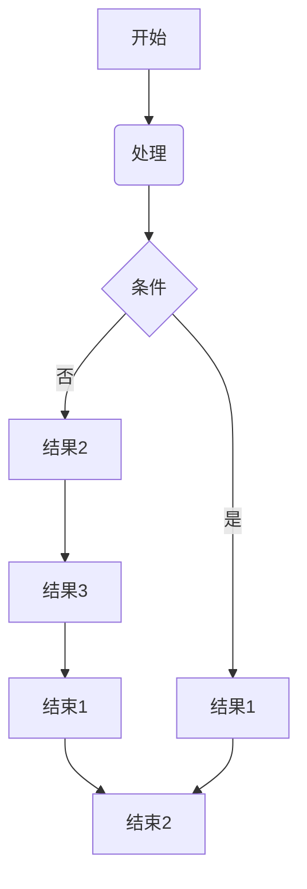

# 图表测试


```mermaid
graph TD
    A[开始] --> B(处理)
    B --> C{条件}
    C -->|是| D[结果1]
    C -->|否| E[结果2]
    E --> F[结果3]
    F --> G[结束1]
    G --> H[结束2]
    D --> H[结束2]
```

```plantuml
@startuml
Alice -> Bob: 你好
Bob --> Alice: 你好吗?
@enduml
